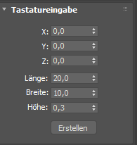

# Prozedurale Generierung von Landschaften mit Unity und 3ds Max

`[Stand 21.05.2019]`

## Inhaltsverzeichnis

**[1. Einleitung](#Einleitung)**

[1.1 Motivation](#Motivation)

[1.2 Zielsetzung](#Zielsetzung)

**[2. Modellierung in 3ds Max](<#Modellierung in 3ds Max>)**

**[3. Generierung in Unity](<#Generierung in Unity>)**

[3.1 Ablauf des Skripts](<#Ablauf des Skripts>)

[3.2 Terrain](#Terrain)

[3.2.1 TerrainData](#TerrainData)

[3.2.2 Layer-Prinzip](#Layer-Prinzip)

[3.3 Biome](#Biome)

[3.4 Berge](#Berge)

[3.4.1 Mathematischer Ansatz](<#Mathematischer Ansatz>)

[3.4.2 Konkrete Umsetzung](<#Konkrete Umsetzung>)

[3.4.3 Sonderfall Wasser](<#Sonderfall Wasser>)

[3.5 Stadt-Generierung](#Stadt-Generierung)

[3.5.1 Abgrenzung von Hausgrundstücken](<#Abgrenzung von Hausgrundstücken>)

[3.5.2 Erstellung eines Hauses](<#Erstellung eines Hauses>)

[3.6 Weitere Landschaftsobjekte](<#Weitere Landschaftsobjekte>)

[3.6.1 Wasser](#Wasser)

[3.6.2 Gräser und Bäume](<#Gräser und Bäume>)

**[4. Spielumsetzung](#Spielumsetzung)**

[4.1 Ladebildschirm](#Ladebildschirm)

[4.2 Allgemeines Spiel](<#Allgemeines Spiel>)

**[5. Fazit](#Fazit)**

-----

## Einleitung

### Motivation

Die prozedurale Generierung ermöglicht die automatisierte Erstellung von 3D-Objekten und virtuellen Welten während der Ausführung eines Computerprogramms, ohne dass die Inhalte in ihrer endgültigen Form vom Entwickler festgelegt sein müssen. Durch den Einsatz von prozedural generierten Landschaften in Filmen, Computerspielen oder virtuellen Welten kann ein erheblicher Mehraufwand bei der Modellierung vermieden werden. In der vorliegenden Projektarbeit soll die automatisierte Generierung dazu beitragen, in kurzer Zeit abwechslungsreiche, organisch wirkende Landschaften zu erstellen.

### Zielsetzung

Das Ziel dieser Projektarbeit ist die prozedurale Generierung von Landschaften mit Wäldern, Wiesen und Flüssen sowie Häusern und Straßen mit den Programmen Unity und 3ds Max. Dazu sollen zum einen Objekte in 3ds Max modelliert werden und zufällig positioniert und zusammengesetzt werden, zum anderen sollen Elemente des Terrains, wie die Höhe der Landschaft, automatisiert in Unity angepasst werden.

Zu erstellende Elemente:

●   Wälder

●   Wiesen

●   Straßen

●   Häuser, bestehend aus kombinierbaren Etagen

●   Flüsse

-----

## Modellierung in 3ds Max

Für die Projektarbeit sollten verschiedene Häuser als 3D-Modelle in 3ds Max erstellt werden. Um eine möglichst große Variablilität zu erreichen wurden hierzu mehrere Erdgeschosse, weitere Etagen und Dächer erstellt, die dann beliebig miteinander kombiniert wurden.

Bei der Erstellung der Modelle in 3ds Max ist zu beachten, dass die Modelle möglichst einheitliche Maße aufweisen sollten, damit beim übereinander anordnen keine Unstimmigkeiten zwischen den Größen der Etagen entstehen. Diese zahlengenaue Arbeitsweise soll im Folgenden an einer als Grundlage dienenden Etage demonstriert werden.

Für diese Etagen wurden die Standardmaße 20x10x3 für Länge, Breite und Höhe gewählt. Als Grundelement wurde ein Quader gewählt, um die Angaben präzise umzusetzen, wurden die Angaben als Tastatureingaben angegeben. Zunächst wurde eine Grundfläche erstellt, daher beträgt die Höhe zunächst nur 0,3. In den Parametern wurden 3 Längensegment, 3 Breitensegmente und ein Höhensegment gewählt (vergleiche Abbildungen).

 

Das Objekt wurde daraufhin in ein Polygon umgewandelt, um es zu einer Etage zu erweitern (vergleiche Abbildung).

Auch während des darauffolgenden Verschiebens der Scheitelpunkte an den Rand des Quaders wurde die Computermaus nicht verwendet, stattdessen wurden die textuellen Eingabefenster am unteren Bildschirmrand genutzt, um genaue Angaben nutzen zu können (vergleiche Abbildung)

Als Entfernung vom Mittelpunkt bei X=0 wurde 4,7 gewählt, da die Gesamtbreite 10 beträgt und damit die halbe Breite 5. So bleiben 0,3 für die Wand. Dies wird mit den gegenüberliegenden Scheitelpunkten entsprechend mit -4,7 umgesetzt. Für die oberen und unteren Scheitelpunkte ergeben sich Abstände vom Nullpunkt auf der Y-Achse von 9,7 bzw. -9,7.

Zum Extrudieren der Wände werden nun die äußeren Polygone der oberen Seite gewählt (vergleiche obige Abbildung).

Beim Extrudieren müssen wieder genaue Textangaben gemacht werden, daher wird nach Rechtsklick auf das Objekt auf das als Rechteck angedeutete Fenster links neben Extrudieren geklickt (siehe folgende Abbildung).

Dort wurde als Angabe für die Höhe 2,7 angegeben, um gemeinsam mit der Höhe des Grundobjektes auf genau 3,0 zu kommen.

Die Fenster und Türen wurden zunächst unabhängig von den jeweils anderen Etagen-Modellen gewählt, ebenfalls um eine große Variabilität zu sichern. Im Verlaufe der Entwicklung stellte sich dies jedoch als unvorteilhaft heraus, da unterschiedliche Abstände zwischen Fenstern den Häusern ein unstimmiges Aussehen verlieh. Daher wurden die Etagen-Modelle nochmals so aufeinander abgestimmt, dass die Fenster harmonischer wirken.

Als variierende Elemente wurden Balkone und längere Fensterfronten gewählt. Auf diese Weise wurden mehrere verschiedene Erdgeschosse, Etagen und Dächer erstellt, die sich voneinander unterscheiden und miteinander kombiniert werden können.

-----

## Generierung in Unity

Die Generierung der Landschaft wird in der Laufzeit- und Entwicklungsumgebung Unity vorgenommen. Dazu wird ein Spielobjekt erstellt, im vorliegenden Fall ein “Empty”-Objekt. Diesem wird das beiliegende Skript (“Terrainer.cs”) angefügt. Dieses Skript verlangt mehrere Parameter, damit der gesamte Funktionsumfang des Skripts genutzt werden kann.

Notwendige Angaben sind:

\-    Haus-Objekte

\-    Sammel-Objekte

\-    Spieler-Objekt (First-/Third-Person-Objekt)

\-    Wasser-Objekt

\-    Baum-Objekte

\-    Gras-Objekte

\-    Terrain-Data-Objekt

\-    Biom-Verteilung & -Texturen

\-    Größen-Angaben

Das Skript modifiziert und positioniert diese Objekte so, dass eine organisch wirkende Landschaft entsteht.

## Ablauf des Skripts

Der Ablauf des Skriptes kann im folgenden Diagramm nachvollzogen werden. Zur besseren Übersicht wurde es in 3 Abschnitte eingeteilt:

\-    Initialisierung

\-    Landschafts-Generierung

\-    Objekt-Generierung

Im ersten Teil des Skriptes werden mehrere Initialisierungsvorgänge umgesetzt.

Zunächst wird ein zufälliger Ursprungswert (englisch *Seed*) erstellt. Dieser wird genutzt, um alle folgenden Zufallszahlen zu errechnen. Unter Angabe dieses festgelegten Seeds kann zu einem späteren Zeitpunkt exakt dieselbe Welt erneut berechnet werden.

Nachfolgend werden die zur Generierung notwendigen Terrain-Objekte erstellt (vergleiche *3.2 Terrain*).

Im Anschluss werden verschiedene vorgefertigte Modelle in das Programm geladen. Dazu zählen unter anderem die Schlüssel und Diamanten (im Folgenden als *Sammelobjekte* bezeichnet). Hier werden auch die notwendigen Landschaftstypen (im Folgenden als *Biome* bezeichnet) mit ihren Texturen festgelegt.

Im nächsten Abschnitt des Skriptes wird die Modifizierung des Terrains umgesetzt. Hierzu werden die Zentren der Biome und ihre zugeordneten Texturen auf der Karte verteilt. Für jeden Punkt wird berechnet, zu welchem Biom er gehört. Als Nächstes werden die Ränder zwischen den entstandenen Biomen berechnet. Je nach Art der jeweiligen Biome werden daraufhin auf den Biomen Berge erzeugt und Gräser und Bäume verteilt.

Im dritten Abschnitt werden die Spielobjekte initial positioniert: Das Wasser wird instanziiert, sodass die Landschaft von einem Meer umgeben ist. Die Häuser und Straßen werden in den Stadtgebieten erstellt. Zuletzt wird das Spieler-Objekt an ein Haus positioniert.

### Terrain

Das Projekt besteht aus mehreren grundlegenden Spielobjekten (englisch *Game Objects*). Diese Game Objects repräsentieren in Unity die Figuren, Requisiten und Landschaften. Sie dienen als Container für weitere Komponenten.

Im vorliegenden Projekt wird ein Terrain-Game-Objekt erstellt, welches das Terrain-Objekt und den Terrain-Collider enthält. Diesen Komponenten wird das im Skript gespeicherte TerrainData-Objekt übergeben (vergleiche Abbildung ###). Das Terrain-Objekt ist die Komponente zum Bearbeiten des TerrainData-Objektes (vergleiche *3.2.1 TerrainData*), der Terrain-Collider beinhaltet Informationen, um die physikalische Kollision zu simulieren und das TerrainData-Objekt enthält die notwendigen Informationen des Terrains, etwa die Größen der Karten (vergleiche *3.2.2 Layer-Prinzip*) oder die Höhenangaben des Terrains um den Collider entsprechend anzupassen.

#### TerrainData

Das TerrainData-Objekt enthält wichtige Informationen, die vom Skript verändert werden können.

Es beinhaltet:

\-    Alphamaps (Texturen-Verteilung)

\-    Heightmap (Höhenangaben)

\-    Detail-Layers (Gras-Verteilung)

\-    Baum-Instanzen

\-    Terrain-Größe

Man kann hierbei definieren wie groß die Karte für die Texturen, Höhe und Details sein soll. Im vorliegenden Fall entspricht diese Größe der der Karte.

Die Baum-Instanzen verändern sich durch den Abstand von der Kamera. Dazu bestehen sie aus mehreren Objekten, die ausgetauscht werden. Je kleiner der Abstand zu einem Baum ist, desto detailreicher wird er. Diesen Algorithmus kann man auf beliebige Objekte anwenden.

Das TerrainData-Objekt wird den Komponenten übergeben und dort werden die Einstellungen persistent über die gesamte Laufzeit gespeichert.

#### Layer-Prinzip

Die in *3.2.1 TerrainData* beschriebenen Daten werden zum Großteil in multidimensionalen Arrays gespeichert. Dazu werden jeweils in Bezug auf die X- und Y-Koordinate bestimmte Werte gespeichert. Nachfolgend wird näher erläutert in welcher Art die verschiedenen Informationen gespeichert werden.

Im Falle der Alphamaps ist das Array dreidimensional. Die ersten beiden Dimensionen geben die Position auf der Karte an. In der dritten Dimension wird für alle Texturen ihre Ausprägung an der jeweiligen Stelle gespeichert. Durch einen Gleitkommawert zwischen 0 und 1 (wobei 0 für die maximale Transparenz steht, also für durchsichtig) wird angegeben, wie stark eine Textur angezeigt werden soll. So können mehrere Texturen gleichzeitig angezeigt werden, beispielsweise um einen Übergang zu schaffen.

 

Für die Heightmap wird ein zweidimensionales Array genutzt. Die beiden Dimensionen geben die Position an und der dort gespeicherte Gleitkommawert wird mit dem Höhen-Skalierungsfaktor des TerrainData-Objektes multipliziert um in der Welt die gewünschte Höhe zu berechnen.

Im Fall der Detail-Layers wird ebenfalls ein zweidimensionales Array für die Position benutzt. Gespeichert wird hier jedoch der Index für das ausgewählte Detail (Gras oder ähnliches). Die Engine zeigt an dieser Stelle auf dem Terrain das unter diesem bestimmten Index hinterlegte Objekt an.

### Biome

Das zu erstellende Terrain soll verschiedene Landschaftstypen abdecken, daher werden einzelne Bereiche mit bestimmten Eigenschaften versehen. Eine Sammlung dieser bestimmten Eigenschaften nennt man Biom.

So wurden folgende Biome definiert:

\-    Stadt

\-    Wald

\-    Feld

\-    Wasser

\-    Berg

Dabei spezifizierte Eigenschaften werden im folgenden Bild abgebildet. So wird eine Stadt nicht so uneben sein, wie ein Wald. Sie besitzt auch weniger Flora, dafür aber mehr Gebäude.

Die Herausforderung besteht darin, die verschiedenen Biome so auf die Karte aufzuteilen, dass die Landschaft organisch und nicht künstlich wirkt. Die Biome sollen also nicht einfach rechteckig platziert werden, da dies in der Natur auch nicht der Fall ist.

Für dieses Vorhaben werden auf der Karte zufällig “Kernpunkte” verteilt. Diese Kernpunkte sind jeweils einem Biom zugeordnet. Daraufhin wird durch jeden Punkt auf der Karte iteriert, der Abstand aller Kernpunkte zu diesem Punkt berechnet und das Biom des am nächsten liegenden Kernpunktes übernommen.

Die Berechnung des Abstandes kann auf der Grundlage verschiedener Ansätze vorgenommen werden. Die folgenden Abbildungen zwigen diese. Die Biome wurden entsprechenden eingefärbt. Die schwarzen Punkte vermerken dabei die jeweiligen Kernpunkte eines Biomes:

Der erste Ansatz war es, den Satz des Pythagoras zu nutzen. Das heißt, die Wurzel der Summe der beiden Quadrate der Differenzen der Koordinaten (also der Entfernung jeweils auf der X-Achse und auf der Y-Achse) wurde gebildet:

So erhält man den exakten Abstand beider Punkte. Durch die Berechnung des kürzesten Abstands entstehen jedoch sehr eckige Ergebnisse:

Der nächste Ansatz war, die Summe der Beträge von den Differenzen Koordinaten zu bilden:

Diese Funktion wird nachfolgend als Pyramiden-Funktion bezeichnet. Bei dieser erscheinen die Biome etwas runder, wirken jedoch immer noch etwas eckig:

Da der erste Ansatz mehr Geraden und der zweite Ansatz mehr Ecken aufweist, war die Überlegung beide Ansätze miteinander zu kombinieren. Dazu bildet man aus beiden den Durchschnitt:

Das Ergebnis unter Einbeziehung beider Ansätze sieht folgendermaßen aus:

Die daraus resultierende Verteilung der Biome besitzt sowohl Geraden als auch abgeschwächte Ecken. Um eine der Eigenschaften mehr ins Gewicht fallen zu lassen, kann man die einzelnen Ansätze durch Faktoren beeinflussen:

Die unter Einbeziehung beider Faktoren errechnete Verteilung erschien im Vergleich am organischsten. Daher wurde diese Abstandsberechnung implementiert.

### Berge

Der Begriff “Berg” schließt in diesem Kontext alle Erhebungen ein, die in der Landschaft vorkommen können.

#### Mathematischer Ansatz

Alle Berge sind identisch aufgebaut: Jeder Berg hat einen Höhepunkt und verläuft mit Abstufungen zum Boden. 

Alle Punkte, die neben dem Höhepunkt liegen müssen niedriger sein, als der der Höhepunkt. Wie viel niedriger die umliegenden Punkte werden hängt von zwei Funktionen ab. Die erste Funktion beschreibt den Abstand zum Mittelpunkt. Die zweite Funktion nutzt das Ergebnis der ersten Funktion als Eingabeparameter und beschreibt, wie stark die Höhe in Abhängigkeit von dem Abstand abnimmt.

Für die erste Funktion kamen wieder die zuvor behandelten Abstandsfunktionen infrage (*vergleiche 3.3 Biome*). Nach einem Vergleich der drei Funktionen erschien die Pyramiden-Funktion am organischsten:

Die zweite Funktion gestaltete sich hierbei schwieriger. Daher mussten zunächst Bedingungen gewählt werden, die diese Funktion erfüllen muss. Die Funktion kann hierbei als Querschnitt des Berges abgebildet werden, da sie aufgrund der Abstandsfunktion um den Mittelpunkt rotiert. Die Funktion bildet somit einen Rotationskörper um die Y-Achse.

Die gesuchte Funktion benötigt einen Hochpunkt bei X gleich Null. Eine Nullstelle und auf der Hälfte der Strecke vom Hochpunkt zur Nullstelle einen Wendepunkt. 

Weiterhin muss sie verschiedene Parameter nutzen, um einen entsprechenden Berg zu erstellen. Dazu zählen der Y-Wert des Hochpunktes wie auch der X-Wert der Nullstelle.

Eine Funktion, die diese Anforderungen erfüllt ist die Kosinusfunktion:

Hierbei steht der Parameter *a* für die maximale Höhe des zu erstellenden Berges und der Parameter *b* für die maximale Breite. Diese Werte müssen nun noch so gewählt werden, dass homogen wirkende Berge entstehen. Diese werden im folgenden Kapitel *3.4.2 Konkrete Umsetzung* geklärt.

#### Konkrete Umsetzung

Damit Berge nur innerhalb einzelner Biome gesetzt werden können, benötigt man die Grenzpunkte der Biome. Dazu werden jeweils die umliegenden Punkte eines jeden Punktes überprüft, ob diese in demselben Biom liegen. Wenn nur einer von diesen einem anderen Biom gehört, wird dieser Punkt als Grenzpunkt gespeichert.

Nun kann man für jedes Biom die Anzahl der Berge ausrechnen. Dazu nimmt man den Grad der Unebenheit und multipliziert ihn mit dem jeweiligen prozentualen Anteil dieses Bioms. Die Mittelpunkte der Berge werden zufällig in dem Biom verteilt. 

Damit Teile eines Berges nicht in einem anderen Biom liegen, wird der maximale Abstand zur Grenze ermittelt. Dieser Abstand wird als Parameter *b* in der Bergfunktion eingesetzt. 

Der Parameter *a* ist Parameter *b* multipliziert mit dem Grad der Unebenheit und dividiert durch 10.000.

Zum Schluss wird durch alle Punkte um den Mittelpunkt iteriert, deren Differenz der X- und Y-Koordinate geringer ist als die maximale Breite (Parameter b). Der entsprechende Wert wird in der in *3.2.2 Layer-Prinzip* besprochenen Heightmap gespeichert.

#### Sonderfall Wasser

Wasser-Biome benötigen eine negative Höhe, da sie unterhalb des Meeresspiegels verlaufen. Allerdings erlaubt das TerrainData-Objekt nur positive Höhenangaben. Um Seen und Teiche dennoch anlegen zu können, werden alle anderen Werte um eine Standardhöhe erhöht, sodass der Wasserbereich von 0 bis zur Standardhöhe verläuft.

### Stadt-Generierung

Damit ein Haus platziert werden kann, muss festgestellt werden, ob ein infrage kommender Bereich frei ist und sichergestellt werden, dass dieser in einem Stadtgebiet liegt.

#### Abgrenzung von Hausgrundstücken

Für die Häuser wurde eine feste Größe für ein Hausgrundstück festgelegt (38x38). Anhand dieser Größe wird jeder Nicht-Grenz-Stadt-Punkt durchlaufen, um die Punkte des zukünftigen Grundstückes zu überprüfen und festzustellen, ob der Platz für ein Haus geeignet ist. Wenn dem nicht so ist, wird dieser Punkt übersprungen und der nächste wird überprüft. Wenn diese Schleife abgeschlossen ist, hat man eine Reihe von Plätzen.

Nun können diese Grundstücke variabel mit dem Haus belegt werden. Dafür kann man seine verfügbaren 1216 ( = 38²) Punkte frei einteilen. Eine Variante ist folgende:

Die grauen Punkte stehen für die Straßen bzw. Wege, die roten Punkte für das Haus und die grünen Punkte symbolisieren einen Garten. Die entsprechenden Elemente müssen nun in die Bereiche eingefügt werden.

Für die Straßen wird eine Asphalt-Textur aufgebracht. In den Garten könnten etwaige Details eingefügt werden, wie z.B. Blumen oder Büsche. Auch Bäume könnten dort einen Platz finden. Auf die roten Punkte wird das Haus gesetzt

#### Erstellung eines Hauses

Damit nicht jedes Haus gleich aussieht, werden die in 3ds Max erstellten Etagen genutzt. Diese werden in 3 Arten unterteilt:

\-    Erdgeschoss

\-    Etage

\-    Dach

Mit dieser Einteilung wird ein Erdgeschoss-Objekt mit einer zufälligen Anzahl zufällig gewählter Etagen erhöht und mit einem wiederum zufällig gewählten Dach nach oben abgegrenzt. Es wurde hierbei festgelegt, dass höchstens 3 Etagen zu einem Haus hinzugefügt werden dürfen. So können beispielsweise Häuser mit nur einem Erdgeschoss und einem Dach entstehen:

Weiterhin entstehen auch Häuser mit insgesamt 5 Elementen:

### Weitere Landschaftsobjekte

#### Wasser

Um Wasser in der Landschaft darzustellen, wird ein Wasserpegel festgelegt. Dieser ist nahezu so hoch wie die Standardhöhe des Terrains. Dadurch werden alle Gebiete unterhalb dieses Meeresspiegels “überflutet”, wenn das Wasser-Objekt hinzugefügt wird. Dieses ist das Standard-Wasser-Objekt von Unity. Es wird in die Mitte der Landschaft platziert, der Radius wird auf die Breite bzw. Länge der Landschaft skaliert. Dadurch wird der Durchmesser des kreisförmigen Objektes doppelt so groß wie die Landschaft. Zusätzlich erhält das Terrain einen Rand, der entsprechend der Berg-Funktion (vergleiche *3.4.1 Mathematischer Ansatz*) nach unten verläuft. Durch diesen fällt der Spieler nicht aus der Welt, wenn er den Rand des eigentlichen Terrains erreicht. Dadurch erhält man folgende Abstände von der Küste zum Ende des Wasser-Objektes:

An den grün markierten Linien ist der Abstand die Hälfte der Terrain-Länge *a* minus dem Abstand *b* 

An den rot markierten Linien ist der Abstand kleiner. Er kann durch folgende Formel errechnet werden:

 Ein Blick von der Ecke des Terrains sieht dann folgendermaßen aus (b=100):

Der Abstand wurde so gewählt, damit der Spieler das Ende der Welt nicht erkennen kann und den Eindruck gewinnt, die Welt sei endlos.

#### Gräser und Bäume

Gräser werden an jeder Stelle der entsprechenden Biome angezeigt. Der Detail-Layer für Gras beinhaltet daher an jeder Position der folgende Biome den Wert 1:

\-    Feld

\-    Wald

\-    Berg

Für die Bäume wird eine Anzahl festgelegt, beispielsweise 1.000 Stück. Danach wird eine zufällige Position berechnet. Wenn diese in den gerade beschriebenen Biomen liegt, wird dort ein Baum instanziiert. Welche Art Baum (Nadel- oder Laubbaum) wird anhand des Biomes festgelegt. Auf Bergen wachsen nur Nadelbäume, auf dem Feld nur Laubbäume und in den Wäldern beide Arten von Bäumen. Dazu wird die Größe der Bäume zufällig verändert, damit nicht alle Bäume gleich aussehen.

-----

## Spielumsetzung

### Ladebildschirm

Da die Spielwelt erst zur Laufzeit erstellt wird, benötigt das Programm am Anfang eine Ladezeit (mehr als eine Minute). Während dieser Laufzeit kommuniziert das Hauptskript mit einem weiteren Skript, das für einen Ladebildschirm zuständig ist. Dieser zeigt dem Spieler die Aufgaben an, welche das Programm gerade berechnet und eine Fortschrittsanzeige:

### Allgemeines Spiel

Das Spielprinzip ist bewusst sehr einfach gehalten, da sich diese Arbeit vorrangig mit dem prozeduralen Generieren der Landschaft beschäftigt. Dennoch wurde ein kleines Sammelspiel eingebaut, damit der Nutzer ein Bild davon machen kann, was mit der generierten Landschaft möglich ist.

Wenn das Spiel gestartet wird, erscheint ein Startbildschirm, auf dem der Spieler den “Generieren”-Knopf betätigen muss. Sobald dies geschehen ist, wechselt das Spiel zum Ladebildschirm. Wenn das Generieren abgeschlossen ist, kann der Spieler die Welt als First-Person-Objekt erkunden. Er startet an einem Haus (vergleiche *3.1 Ablauf des Skripts*). In der obersten Etage der Häuser kann er Schlüssel finden. Besitzt er mindestens drei Schlüssel, kann er eine der Truhen öffnen, die in der Stadt verteilt sind. In diesen Truhen sind blaue und rote Diamanten versteckt, die von unterschiedlichem Wert sind. In jedem Stadtkern kann der Spieler drei Schlüssel und eine Truhe finden. Ziel des Spieles ist es, den Gegenwert aller in den Truhen versteckten Diamanten zu finden. Wenn dem Spieler dies gelungen ist, wird auf dem Bildschirm “Gewonnen!” ausgegeben und das Spiel ist vorbei. Das Spiel kann jederzeit mit der Escape-Taste beendet werden.

Statt die Schlüssel zu suchen, kann der Spieler außerdem grüne Diamanten sammeln, um die Diamanten-Punktezahl zu erhöhen. Die grünen Diamanten können in den anderen Biomen gefunden werden, sind jedoch weniger Wert als in Truhen versteckte Diamanten.

-----

## Fazit

Die erschaffene Landschaft lässt sich mit dem Skript nun einfach generieren und wirkt auf den Betrachter natürlich. Die Landschaft besitzt verschiedene Arten von Biomen, die jeweils einzigartige Eigenschaften vorweisen. Auch die Verteilung der Gebäude in den Städten ist fürs Erste annehmbar. Die vorliegende Projektarbeit ist damit ihren Zielen grundsätzlich gerecht geworden.

Jedoch konnten nicht alle gesetzten Ziele erreicht werden, da die Komplexität dieser höher als erwartet war. Erste Straßen wurden zwar bereits implementiert, doch diese werden nur abhängig von den Häusern angelegt und das Straßenbild nicht zufällig generiert. Auch “Landstraßen” zwischen Städten oder Flüsse werden noch nicht generiert.

Mögliche Verbesserungen können vor allem im Stadtgebiet vorgenommen werden. Bisher wirkt die Stadt kalt und leer. Es existieren jedoch bereits gute Ansätze die weiter vertieft werden könnten. So kann das bisher einfache Hausgrundstück noch durch Details, wie einen Garten oder Baum verschönert werden (vergleiche *3.5.1 Abgrenzung von Hausgrundstücken*). Diese kann man zufällig platzieren, sodass jedes Grundstück einzigartig wird. Weiterhin können Grundstücke kombiniert und aus ihnen Häuserblöcke erstellt werden. Es besteht auch die Möglichkeit weitere Häusermodelle oder Haustexturen zu erstellen.

Weitere Optimierungen können an den Algorithmen vorgenommen werden, da der Generierungsprozess bisher relativ zeitintensiv ist. So nimmt das Berechnen der Grenzpunkte (vergleiche *3.4.2 Konkrete Umsetzung*) viel Zeit in Anspruch. Bisher wurde der Quellcode noch keinen Geschwindigkeitsoptimierungen unterworfen.

An diesen Punkten wird deutlich, dass viele lohnende Ansatzpunkte für zukünftige Projekte vorhanden sind. Dennoch bietet der bisher erreichte Projektstand eine gute Grundlage, um eine automatisiert generierte Karte in ersten Spielen zu nutzen.